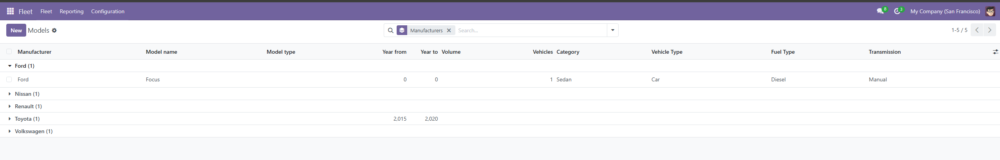
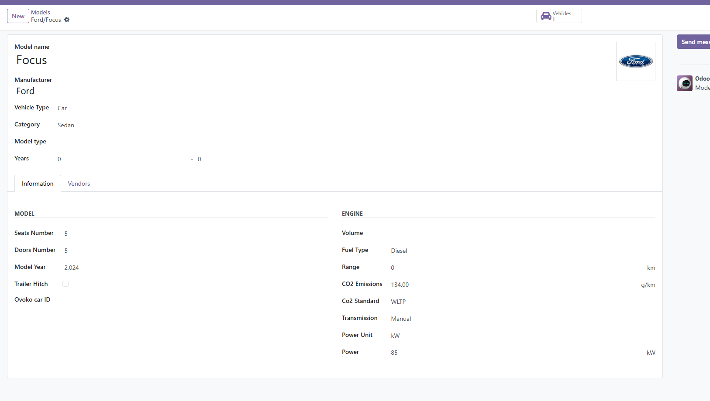
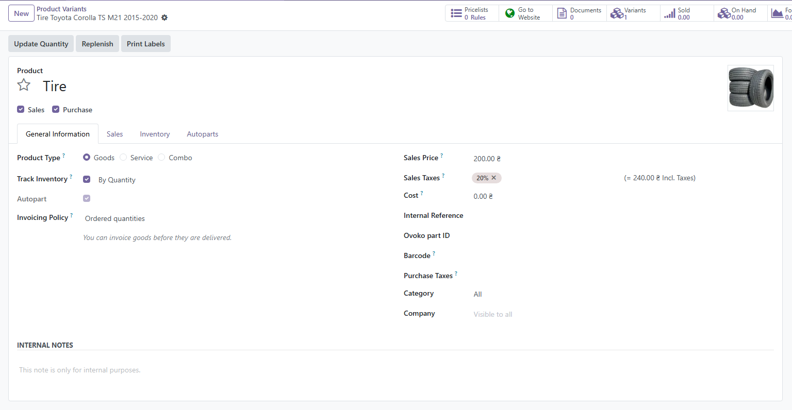
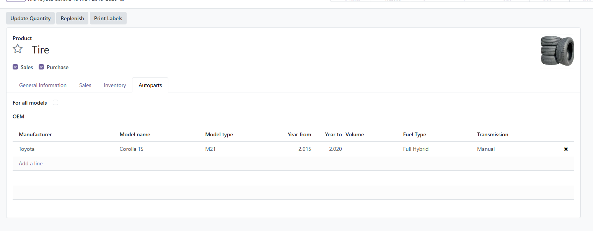
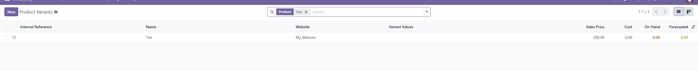
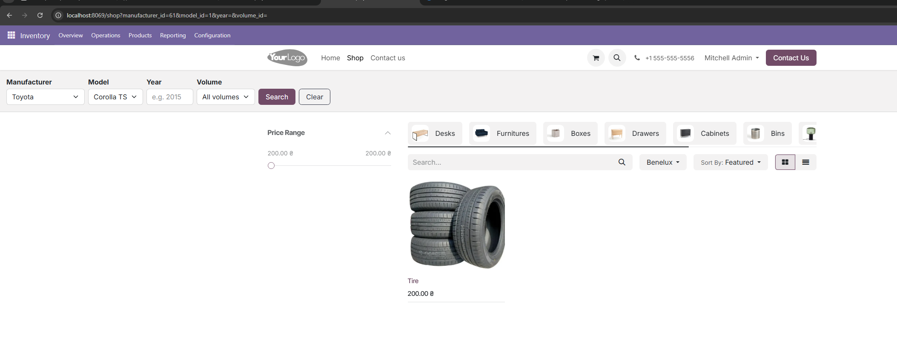
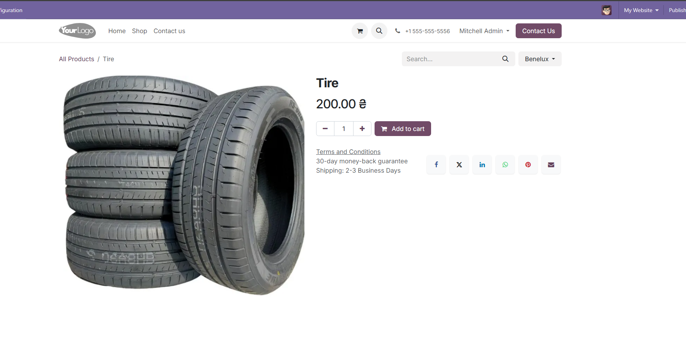
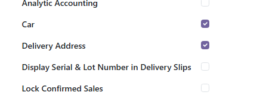

# Add Car to Product

Модуль для Odoo 18 CE, який додає функціональність магазину автозапчастин.

## Можливості

- Розширює модель автомобілів (`fleet.vehicle.model`) полями типу, років випуску, об'єму двигуна та ідентифікатора Ovoko
- Дозволяє позначати товари як автозапчастини (`Is Autopart`)
- Прив'язує варіанти товарів до конкретних моделей авто через таблицю сумісності
- Автоматично формує назву варіанту товару на основі марки/моделі авто
- Додає пошук на сайті магазину за маркою, моделлю, роком та об'ємом двигуна

## Залежності

- `fleet` — модуль управління автопарком
- `product` — базовий модуль товарів
- `website_sale` — модуль інтернет-магазину

## Запуск сервера

**Просто запустити:**
```bash
c:\odootest\venv\Scripts\python.exe -m odoo -c C:\odootest\odoo.conf
```

**Запустити з оновленням модуля:**
```bash
c:\odootest\venv\Scripts\python.exe -m odoo -c C:\odootest\odoo.conf -d redcrest -u add_car_to_product
```

**Після запуску відкрити:** `http://localhost:8069`

---

## Встановлення

1. Скопіюйте папку `add_car_to_product` до директорії кастомних модулів
2. Переконайтесь що шлях вказано в `odoo.conf` → `addons_path`
3. Оновіть список додатків: **Apps → Update Apps List**
4. Знайдіть **Add Car to Product** і натисніть **Activate**

---

## Використання

### Моделі авто (Fleet → Configuration → Models)

Список моделей з новими колонками: тип моделі, роки випуску, об'єм двигуна.



Картка моделі з розширеними полями: Model type, Years, Volume, Ovoko car ID.



Додані поля:
| Поле | Опис | Приклад |
|------|------|---------|
| Model type | Варіант моделі | E84 |
| Year from | Рік початку випуску | 2009 |
| Year to | Рік закінчення випуску | 2015 |
| Volume | Об'єм двигуна | 1598 |
| Ovoko car ID | ID авто в системі Ovoko | — |

---

### Товари (Inventory → Products)

Відкрийте будь-який товар і поставте галку **Autopart** у вкладці General Information. Назва варіанту формується автоматично на основі прив'язаного авто.



У вкладці **Autoparts** додайте сумісні моделі авто через таблицю.



Список варіантів товару (Inventory → Products → Variants):



> Вкладка **Autoparts** доступна лише користувачам групи **Car**

---

### Пошук на сайті магазину

На сторінці магазину (`/shop`) доступний блок пошуку автозапчастин за маркою, моделлю, роком та об'ємом двигуна. При виборі марки список моделей оновлюється автоматично.



Сторінка товару на сайті:



---

### Назва варіанту

Формується автоматично за правилом:
```
{Назва шаблону} {Марка} {Модель} {Тип моделі} {Рік від}-{Рік до}
```
Приклад: `Tire Toyota Corolla TS M21 2015-2020`

---

## Права доступу

| Група | Доступ |
|-------|--------|
| Всі користувачі | Перегляд об'ємів двигунів |
| Fleet Manager | Повний доступ до об'ємів двигунів |
| Car | Перегляд та редагування вкладки Autoparts |

Увімкнути групу **Car** для користувача: Settings → Users → вибрати користувача → Car.


